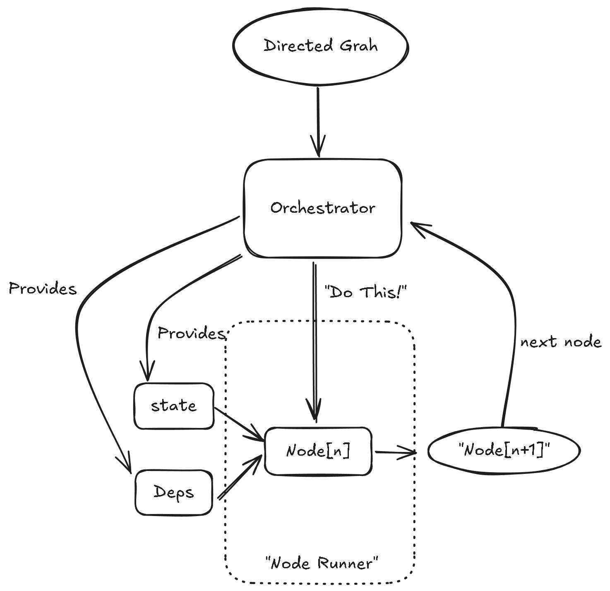

## Why Our AI Agents Need Better Workflow Management

Imagine you're cooking a complex meal in your kitchen. Each dish requires multiple steps, some need to be monitored continuously, while others can run in parallel. Now imagine trying to coordinate all this while constantly getting interrupted by your doorbell, your phone, and your cat demanding attention.

This is the challenge modern AI agent developers face. As AI agents grow more capable, we're asking them to handle increasingly complex workflows: researching topics across multiple sources, engaging in multi-turn dialogues, managing tool usage, and persisting state across interruptions.

The traditional approach—writing long, complex functions with nested conditionals—quickly becomes unwieldy. It's like trying to run that busy kitchen with a single chef doing everything sequentially.

## Enter the Graph-Based Approach

A graph-based approach to agent workflows is like having a well-organized kitchen with a head chef (the orchestrator) coordinating specialized station chefs (the nodes). Each chef knows their specific task and who to pass the dish to next.

But why is this approach particularly valuable for AI agents?

### The Problem with Traditional Approaches

Let's say you're building an AI research assistant that needs to:

1. Understand a user's query
2. Search for relevant information
3. Synthesize findings
4. Generate a report
5. Handle user follow-up questions

Using traditional programming approaches, you might end up with something like:

```python
def research_assistant(query):
    # Parse the query
    parsed_query = parse_query(query)
    
    # Search for information
    results = search_for_info(parsed_query)
    
    # Synthesize findings
    synthesis = synthesize_findings(results)
    
    # Generate report
    report = generate_report(synthesis)
    
    # Return result
    return report

# And then a separate function for follow-ups...
def handle_followup(original_query, report, followup_question):
    # More complex logic...
    pass
```

This approach breaks down when:

- The process takes longer than a single request/response cycle
- Users want to interrupt and modify the workflow
- You need to pick up where you left off after a system failure
- You want to visualize and understand the complex flow

### The Kitchen Brigade System for AI Workflows

In professional kitchens, they use the "brigade system" where each chef has a specialized role. Communication is structured, and there's a clear chain of command. This allows for complex meal preparation to happen reliably and efficiently.

Similarly, graph-based AI agent workflows:

1. Break complex processes into discrete nodes
2. Maintain a persistent state that flows through the entire process
3. Define clear transitions between steps
4. Allow for interruption and resumption
5. Make the entire workflow visible and auditable

## How Graph Execution Works

Let's explore how a graph-based approach works conceptually:



In this model:

1. The **Directed Graph** defines all possible paths the agent can take
2. The **Orchestrator** manages the execution flow and maintains state
3. The **Node Runner** executes individual actions
4. **State** and **Dependencies** are provided to each node but managed centrally

### A Real-World Example: Restaurant Order Processing

Let's consider how a restaurant handles orders:

1. **TakeOrder Node**: The waiter takes your order and writes it on a ticket
2. **VerifyOrder Node**: The waiter confirms your order is correct
3. **RouteOrder Node**: The order ticket goes to different kitchen stations based on what you ordered
4. **PrepareFood Node**: Different chefs prepare different parts of your meal
5. **QualityCheck Node**: The head chef inspects the completed dishes
6. **DeliverFood Node**: The waiter brings food to your table
7. **ProcessPayment Node**: You pay for your meal

This workflow:

- Has a clear sequence and decision points
- Maintains state (your order details) throughout the process
- Can handle interruptions (you modify your order)
- Has specialized nodes for specific tasks
- Can run some steps in parallel (different chefs working simultaneously)

### How State Flows Between Nodes

The magic happens in how state flows through this system. In our restaurant:

- The order ticket is the "state"
- Each station adds information to it
- The ticket moves from station to station
- Anyone can look at the ticket to understand the current status

In a graph-based AI system:

- The state object contains all context needed for the workflow
- Each node can read from and write to this state
- The orchestrator ensures the state persists between nodes
- The state can be saved to allow for pauses and resumptions

## From Concept to Code: PydanticAI's Graph-Based Approach

Now that we understand the concepts, let's look at how this translates to code using PydanticAI's `pydantic_graph` framework. We're specifically choosing PydanticAI because:

1. It's production-ready with enterprise-grade stability
2. It provides strict type enforcement throughout the workflow
3. It integrates seamlessly with AI agents and LLMs
4. It offers built-in state persistence capabilities
5. It allows for workflow visualization

Unlike many other graph workflow libraries that sacrifice type safety for flexibility, PydanticAI ensures that your workflows are both flexible AND type-safe. This means many potential bugs are caught at development time rather than runtime - a crucial advantage when building complex AI systems.

Let's build a simple conversational agent that can:

1. Greet the user
2. Ask for their name
3. Ask about their interests
4. Recommend topics based on their interests
5. Say goodbye

### Setting Up the State

First, we define what information our workflow needs to maintain:

```python
from dataclasses import dataclass, field
from typing import List, Optional

@dataclass
class ConversationState:
    """State maintained throughout the conversation."""
    user_name: Optional[str] = None
    interests: List[str] = field(default_factory=list)
    recommendations: List[str] = field(default_factory=list)
```

### Defining Our Nodes

Each node represents a distinct step in our conversation:

```python
from dataclasses import dataclass
from pydantic_graph import BaseNode, End, GraphRunContext

@dataclass
class GreetUser(BaseNode[ConversationState]):
    """Greet the user and start conversation."""
    
    async def run(self, ctx: GraphRunContext[ConversationState]) -> 'AskName':
        print("Hello! Welcome to our recommendation system.")
        return AskName()

@dataclass
class AskName(BaseNode[ConversationState]):
    """Ask for the user's name."""
    
    async def run(self, ctx: GraphRunContext[ConversationState]) -> 'AskInterests':
        name = input("What's your name? ")
        ctx.state.user_name = name
        return AskInterests()

@dataclass
class AskInterests(BaseNode[ConversationState]):
    """Ask about user interests."""
    
    async def run(self, ctx: GraphRunContext[ConversationState]) -> 'GenerateRecommendations':
        interests = input(f"Nice to meet you, {ctx.state.user_name}! What are your interests? ")
        ctx.state.interests = [i.strip() for i in interests.split(',')]
        return GenerateRecommendations()

@dataclass
class GenerateRecommendations(BaseNode[ConversationState, None, str]):
    """Generate recommendations based on interests."""
    
    async def run(self, ctx: GraphRunContext[ConversationState]) -> 'SayGoodbye' | End[str]:
        # Here we could call an LLM to generate recommendations
        for interest in ctx.state.interests:
            ctx.state.recommendations.append(f"Book about {interest}")
        
        print(f"Based on your interests, I recommend:")
        for rec in ctx.state.recommendations:
            print(f"- {rec}")
            
        continue_chat = input("Would you like more recommendations? (yes/no) ")
        if continue_chat.lower() == 'yes':
            return SayGoodbye()
        else:
            return End(f"Thanks for chatting, {ctx.state.user_name}!")

@dataclass
class SayGoodbye(BaseNode[ConversationState, None, str]):
    """Say goodbye to the user."""
    
    async def run(self, ctx: GraphRunContext[ConversationState]) -> End[str]:
        return End(f"Goodbye, {ctx.state.user_name}! Hope you enjoy the recommendations.")
```

Notice how PydanticAI's type annotations make the flow completely transparent. The return type of each node's `run` method explicitly declares what node can come next. This creates a type-safe workflow where invalid transitions are caught at development time.

### Creating and Running the Graph

Now we create the graph structure and run it:

```python
from pydantic_graph import Graph
import asyncio

# Define our graph
conversation_graph = Graph(
    nodes=[GreetUser, AskName, AskInterests, GenerateRecommendations, SayGoodbye],
    state_type=ConversationState
)

# Run the graph
async def main():
    # Initialize state
    state = ConversationState()
    
    # Run the graph starting with GreetUser
    result = await conversation_graph.run(GreetUser(), state=state)
    
    # The result contains the final output
    print(f"Final result: {result.output}")

if __name__ == "__main__":
    asyncio.run(main())
```

### The Power of Persistence

One of the most powerful features of PydanticAI's graph-based workflows is persistence. Let's add the ability to pause and resume our conversation:

```python
from pydantic_graph.persistence.file import FileStatePersistence
from pathlib import Path

async def run_with_persistence():
    persistence = FileStatePersistence(Path("conversation.json"))
    
    # Check if we have a saved conversation
    if await persistence.load_next():
        # Resume from saved state
        async with conversation_graph.iter_from_persistence(persistence) as run:
            print("Resuming previous conversation...")
            node = await run.next()
            print(f"Resumed at node: {node.__class__.__name__}")
    else:
        # Start new conversation
        state = ConversationState()
        await conversation_graph.initialize(GreetUser(), state=state, persistence=persistence)
        
        async with conversation_graph.iter(GreetUser(), state=state, persistence=persistence) as run:
            # Run until we reach AskInterests, then pause
            while True:
                node = await run.next()
                if isinstance(node, AskInterests):
                    print("Pausing conversation... We'll continue later.")
                    break
                elif isinstance(node, End):
                    print(f"Conversation complete: {node.data}")
                    break
```

PydanticAI's persistence capabilities are particularly valuable for AI agents that:

- Need to handle long-running tasks
- Interact with users asynchronously
- Must be resilient to system restarts or failures
- Operate across multiple sessions

## Type Safety: Why It Matters for AI Workflows

You might be wondering why we're emphasizing PydanticAI's type integrity. In AI agent workflows, type safety is not just a nice-to-have—it's essential for reliability.

Consider what happens in an untyped system when you accidentally return the wrong node type or pass incorrect data between nodes. In best-case scenarios, you get runtime errors. In worst-case scenarios, your workflow silently breaks in subtle ways, leading to incorrect results that might go undetected.

With PydanticAI's type enforcement:

1. The compiler catches structural workflow errors before runtime
2. Your IDE can provide intelligent autocomplete for node transitions
3. Data validation ensures state remains consistent
4. Visualization tools can accurately display workflow possibilities

As AI agents take on increasingly critical tasks, this level of reliability becomes non-negotiable.

## Benefits Beyond Just Organization

Using PydanticAI's graph-based approach provides several tangible benefits:

1. **Visualizable workflows**: Generate diagrams automatically to understand complex agent behavior
2. **Resumable execution**: Continue long-running processes after interruptions
3. **Testable components**: Test individual nodes in isolation  
4. **Flexible orchestration**: Modify workflows dynamically based on new requirements
5. **Persistent state**: Maintain context throughout long-running processes
6. **Type-safe transitions**: Ensure workflow integrity through strong typing
7. **Parallizable execution**: Run independent branches concurrently (with appropriate framework support)

## When To Use Graph-Based Approaches

While powerful, graph-based approaches add complexity that isn't always necessary. Consider this approach when:

- Your agent workflow might be interrupted and needs to resume
- You need to visualize complex decision logic
- Your workflow involves many decision points and branches
- You want to maintain complex state across multiple steps
- Different specialists might work on different parts of the flow
- You're building mission-critical systems where type safety is essential

For simpler agents, a more direct approach might be preferable.

## Conclusion: Thinking in Graphs

The graph-based approach fundamentally changes how we think about complex AI workflows. Rather than a monolithic process, we see a series of discrete steps with clear transitions and persistent state.

Just as the kitchen brigade system revolutionized restaurant cooking, PydanticAI's graph-based approach enables us to build more complex, resilient, and maintainable AI agents. As these agents take on increasingly sophisticated tasks, such structured approaches will become not just helpful, but essential.

By choosing a production-ready framework like PydanticAI that emphasizes type safety, we set ourselves up for success as our agent systems grow in complexity. The days of "works on my machine" AI agents are fading—the future belongs to robust, resumable, type-safe workflows.
