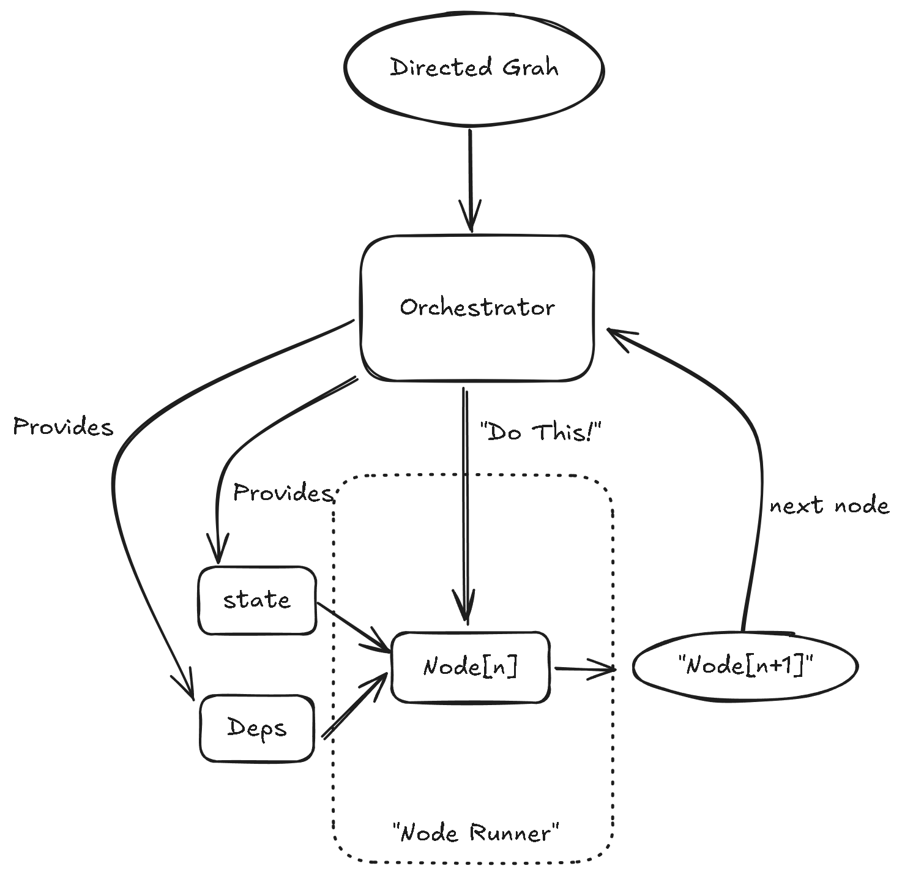

## 为什么我们的AI智能体需要更好的工作流管理

想象你正在厨房里烹饪一顿复杂的饭菜。每道菜都需要多个步骤，有些需要持续监控，有些可以并行进行。现在再想象你在协调这一切的同时，还不断被门铃、电话和猫咪打断。

这正是现代AI智能体开发者所面临的挑战。随着AI智能体能力的提升，我们要求它们处理越来越复杂的工作流：跨多个来源进行主题研究、进行多轮对话、管理工具使用，并在中断后保持状态。

传统做法——编写冗长、复杂、嵌套条件的函数——很快就会变得难以维护。这就像让一个厨师顺序完成所有繁忙厨房的工作一样。

## 基于图的方式登场

基于图的智能体工作流就像一个组织良好的厨房，主厨（编排者）协调着各个专门岗位的厨师（节点）。每个厨师都清楚自己的任务，并知道下一步要把菜交给谁。

但为什么这种方式对AI智能体尤其有价值呢？

### 传统方式的问题

假设你正在构建一个AI研究助手，需要：

1. 理解用户的查询
2. 搜索相关信息
3. 综合研究结果
4. 生成报告
5. 处理用户的后续提问

用传统编程方式，你可能会写出如下代码：

```python
def research_assistant(query):
    # 解析查询
    parsed_query = parse_query(query)
    
    # 搜索信息
    results = search_for_info(parsed_query)
    
    # 综合研究结果
    synthesis = synthesize_findings(results)
    
    # 生成报告
    report = generate_report(synthesis)
    
    # 返回结果
    return report

# 还有一个单独的函数处理后续问题……
def handle_followup(original_query, report, followup_question):
    # 更复杂的逻辑……
    pass
```

这种方式在以下情况下会失效：

- 过程耗时超过一次请求/响应周期
- 用户希望中断并修改工作流
- 需要在系统故障后从断点恢复
- 你希望可视化并理解复杂流程

### AI工作流的厨房分工体系

在专业厨房中，采用“分工体系”，每位厨师都有专门的角色。沟通有结构，指挥链清晰。这让复杂的菜肴制作变得可靠高效。

类似地，基于图的AI智能体工作流：

1. 将复杂流程拆分为独立节点
2. 保持贯穿全流程的持久状态
3. 明确定义各步骤间的转移
4. 支持中断与恢复
5. 让整个工作流可见、可审计

## 图执行是如何工作的

让我们从概念上看看基于图的方法如何运作：



在这个模型中：

1. **有向图**定义了智能体可能采取的所有路径
2. **编排者**管理执行流程并维护状态
3. **节点执行器**负责各个具体动作
4. **状态**和**依赖**由每个节点使用，但统一管理

### 现实案例：餐厅订单处理

看看餐厅如何处理订单：

1. **TakeOrder节点**：服务员记下你的订单
2. **VerifyOrder节点**：服务员确认订单无误
3. **RouteOrder节点**：订单根据内容分发到不同厨房岗位
4. **PrepareFood节点**：不同厨师准备不同部分的餐食
5. **QualityCheck节点**：主厨检查成品
6. **DeliverFood节点**：服务员上菜
7. **ProcessPayment节点**：你结账

这个工作流：

- 有清晰的顺序和决策点
- 在整个流程中维护状态（你的订单详情）
- 能处理中断（你修改了订单）
- 各节点专责特定任务
- 某些步骤可并行（多位厨师同时工作）

### 状态如何在节点间流转

神奇之处在于状态的流转。在餐厅里：

- 订单小票就是“状态”
- 每个岗位都可在上面添加信息
- 小票在各岗位间流转
- 任何人都能通过小票了解当前进度

在基于图的AI系统中：

- 状态对象包含整个工作流所需的全部上下文
- 每个节点都可读取和写入状态
- 编排者确保状态在节点间持续有效
- 状态可保存，实现暂停与恢复

## 从概念到代码：PydanticAI的基于图方式

理解了概念后，我们来看如何用PydanticAI的`pydantic_graph`框架实现。我们选择PydanticAI的原因：

1. 生产级，企业级稳定性
2. 全流程严格类型约束
3. 与AI智能体和LLM无缝集成
4. 内置状态持久化能力
5. 支持工作流可视化

与许多牺牲类型安全换取灵活性的图工作流库不同，PydanticAI确保你的工作流既灵活又类型安全。这意味着许多潜在的bug会在开发时被发现，而不是运行时——对于复杂AI系统来说，这至关重要。

我们来构建一个简单的对话智能体，它能：

1. 问候用户
2. 询问用户姓名
3. 询问兴趣
4. 根据兴趣推荐话题
5. 告别

### 状态的定义

首先，定义工作流需要维护的信息：

```python
from dataclasses import dataclass, field
from typing import List, Optional

@dataclass
class ConversationState:
    """对话过程中维护的状态。"""
    user_name: Optional[str] = None
    interests: List[str] = field(default_factory=list)
    recommendations: List[str] = field(default_factory=list)
```

### 定义各节点

每个节点代表对话中的一个独立步骤：

```python
from dataclasses import dataclass
from pydantic_graph import BaseNode, End, GraphRunContext

@dataclass
class GreetUser(BaseNode[ConversationState]):
    """问候用户并开启对话。"""
    
    async def run(self, ctx: GraphRunContext[ConversationState]) -> 'AskName':
        print("你好！欢迎使用我们的推荐系统。")
        return AskName()

@dataclass
class AskName(BaseNode[ConversationState]):
    """询问用户姓名。"""
    
    async def run(self, ctx: GraphRunContext[ConversationState]) -> 'AskInterests':
        name = input("请问你的名字是？")
        ctx.state.user_name = name
        return AskInterests()

@dataclass
class AskInterests(BaseNode[ConversationState]):
    """询问用户兴趣。"""
    
    async def run(self, ctx: GraphRunContext[ConversationState]) -> 'GenerateRecommendations':
        interests = input(f"很高兴认识你，{ctx.state.user_name}！你有哪些兴趣？")
        ctx.state.interests = [i.strip() for i in interests.split(',')]
        return GenerateRecommendations()

@dataclass
class GenerateRecommendations(BaseNode[ConversationState, None, str]):
    """根据兴趣生成推荐。"""
    
    async def run(self, ctx: GraphRunContext[ConversationState]) -> 'SayGoodbye' | End[str]:
        # 这里可以调用LLM生成推荐
        for interest in ctx.state.interests:
            ctx.state.recommendations.append(f"关于{interest}的书籍")
        
        print("根据你的兴趣，我推荐：")
        for rec in ctx.state.recommendations:
            print(f"- {rec}")
            
        continue_chat = input("还需要更多推荐吗？（yes/no）")
        if continue_chat.lower() == 'yes':
            return SayGoodbye()
        else:
            return End(f"感谢你的交流，{ctx.state.user_name}！")

@dataclass
class SayGoodbye(BaseNode[ConversationState, None, str]):
    """向用户道别。"""
    
    async def run(self, ctx: GraphRunContext[ConversationState]) -> End[str]:
        return End(f"再见，{ctx.state.user_name}！希望你喜欢这些推荐。")
```

注意，PydanticAI的类型注解让流程一目了然。每个节点的`run`方法的返回类型明确声明了下一个可能的节点。这创造了类型安全的工作流，非法转移会在开发时被发现。

### 创建并运行图

现在我们创建图结构并运行：

```python
from pydantic_graph import Graph
import asyncio

# 定义工作流图
conversation_graph = Graph(
    nodes=[GreetUser, AskName, AskInterests, GenerateRecommendations, SayGoodbye],
    state_type=ConversationState
)

# 运行图
async def main():
    # 初始化状态
    state = ConversationState()
    
    # 从GreetUser节点开始运行
    result = await conversation_graph.run(GreetUser(), state=state)
    
    # 输出最终结果
    print(f"最终结果：{result.output}")

if __name__ == "__main__":
    asyncio.run(main())
```

### 持久化的力量

PydanticAI基于图的工作流最强大的特性之一就是持久化。让我们为对话增加暂停和恢复的能力：

```python
from pydantic_graph.persistence.file import FileStatePersistence
from pathlib import Path

async def run_with_persistence():
    persistence = FileStatePersistence(Path("conversation.json"))
    
    # 检查是否有已保存的对话
    if await persistence.load_next():
        # 从保存的状态恢复
        async with conversation_graph.iter_from_persistence(persistence) as run:
            print("恢复上次对话……")
            node = await run.next()
            print(f"恢复到节点：{node.__class__.__name__}")
    else:
        # 开始新对话
        state = ConversationState()
        await conversation_graph.initialize(GreetUser(), state=state, persistence=persistence)
        
        async with conversation_graph.iter(GreetUser(), state=state, persistence=persistence) as run:
            # 运行到AskInterests节点后暂停
            while True:
                node = await run.next()
                if isinstance(node, AskInterests):
                    print("对话已暂停……稍后继续。")
                    break
                elif isinstance(node, End):
                    print(f"对话完成：{node.data}")
                    break
```

PydanticAI的持久化能力对于需要：

- 处理长时间任务
- 异步与用户交互
- 需应对系统重启或故障
- 跨多会话运行

的AI智能体尤为重要。

## 类型安全：为何对AI工作流至关重要

你可能会疑惑，我们为何如此强调PydanticAI的类型完整性。在AI智能体工作流中，类型安全不仅是锦上添花——而是可靠性的基础。

想象在无类型系统中，意外返回了错误的节点类型或在节点间传递了错误数据。最好的情况是运行时报错，最坏的情况是工作流悄悄出错，导致结果不正确却难以察觉。

有了PydanticAI的类型约束：

1. 编译器在运行前就能发现结构性错误
2. IDE可为节点转移提供智能补全
3. 数据校验确保状态一致
4. 可视化工具能准确展示工作流可能性

随着AI智能体承担越来越关键的任务，这种可靠性变得不可或缺。

## 不止是组织结构的好处

使用PydanticAI的基于图方式带来多项实际优势：

1. **可视化工作流**：自动生成流程图，直观理解复杂行为
2. **可恢复执行**：中断后可继续长时间运行的流程
3. **可测试组件**：单独测试每个节点
4. **灵活编排**：根据新需求动态调整流程
5. **持久化状态**：在长流程中持续保持上下文
6. **类型安全转移**：强类型保障流程完整性
7. **可并行执行**：独立分支可并发运行（需框架支持）

## 何时使用基于图的方法

虽然强大，基于图的方法也带来一定复杂度。适合以下场景：

- 智能体工作流可能被中断且需恢复
- 需要可视化复杂决策逻辑
- 流程包含众多决策点和分支
- 需在多步骤间维护复杂状态
- 不同专家负责流程不同部分
- 构建对类型安全有严格要求的关键系统

对于简单智能体，直接方式可能更合适。

## 总结：用图思考

基于图的方法从根本上改变了我们对复杂AI工作流的思考方式。我们不再将其视为单一的整体过程，而是由一系列明确步骤、清晰转移和持久状态组成。

正如厨房分工体系革新了餐饮业，PydanticAI的基于图方法让我们能够构建更复杂、更可靠、更易维护的AI智能体。随着这些智能体承担越来越复杂的任务，这种结构化方式将不仅是有益的，而是必不可少的。

选择像PydanticAI这样强调类型安全的生产级框架，为我们的智能体系统日益复杂做好了准备。“只在我的电脑上能跑”的AI智能体时代正在过去——未来属于健壮、可恢复、类型安全的工作流。